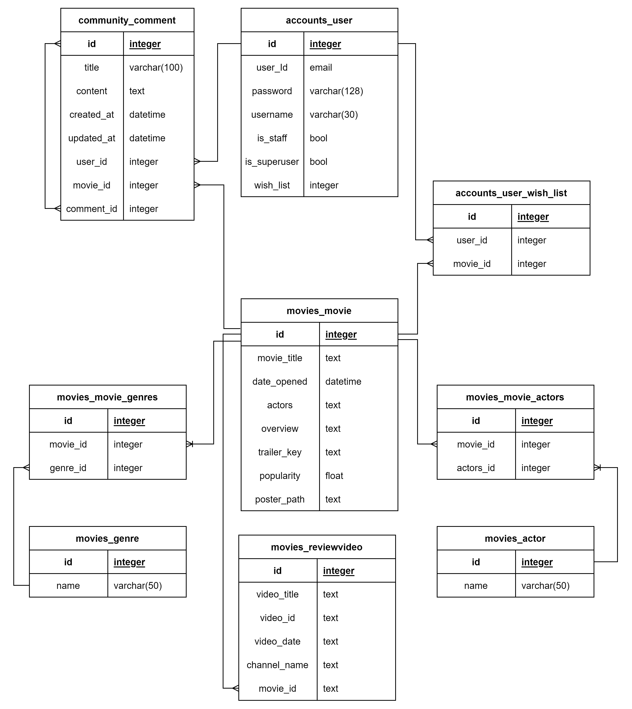
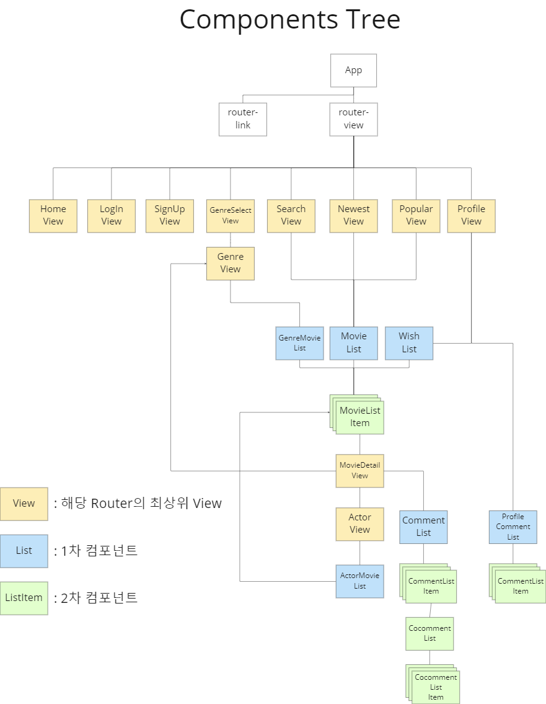
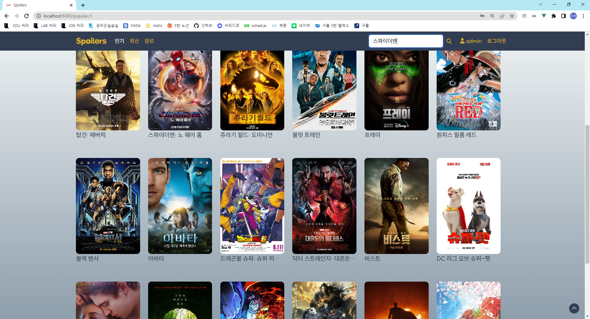
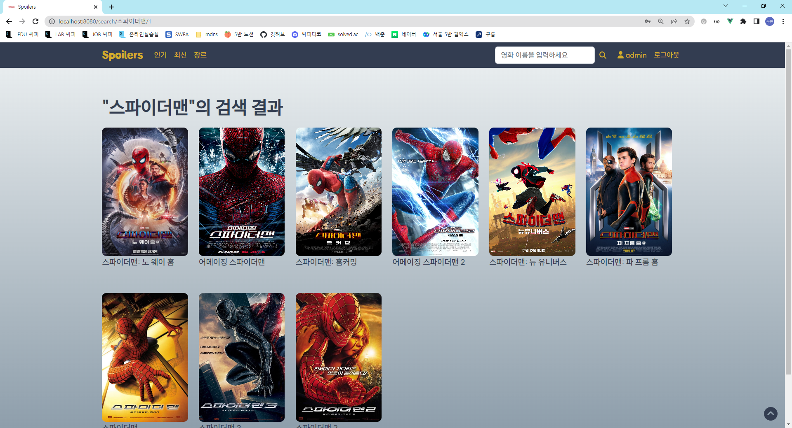

# FINAL PJT

## 프로젝트 목표

- 영화 데이터 기반 추천 서비스 구성
- 영화 추천 알고리즘 구성
- 커뮤니티 서비스 구성
- 서비스 관리 및 유지보수

## 사용 아키텍처

- Django REST Framework
- Vue

## 개요

### Spoilers

리뷰 및 트레일러와 같은 영상을 중심으로 영화에 대한 정보를 보여주는 홈페이지입니다.

영화를 보기 전에도 현재 접근 가능한 정보들을 최대한 확인해서 스포일러를 알게 된다는 의미의 제목입니다

### URL

| url                                 | view 함수      | 기능                 | 내용                                         |
| ----------------------------------- | -------------- | -------------------- | -------------------------------------------- |
| /admin/                             |                | 어드민               | 어드민 페이지                                |
| /movies/                            | movie_list     | 전체 영화 api        | 전체 영화 데이터 API                         |
| /movie/<movie_pk>/                  | movie_detail   | 개별 영화 api        | 세부적인 영화 정보 및 리뷰 영상 조회         |
| /movie/<movie_pk>/reviews/          | review_vid     | 리뷰 데이터 추가     | 영화에 해당하는 리뷰 비디오 링크 데이터 추가 |
| /movie/genres/                      | genre_list     | 전체 장르 api        | 전체 장르 데이터 API                         |
| /api/accounts/                      | user_detail    | user api             | 유저 정보 api로 출력                         |
| /accounts/login/                    |                | 로그인               | 로그인 정보를 받아 토큰 발행                 |
| /accounts/signup/                   |                | 회원가입             | 회원가입정보를 받아 가입후 토큰 발행         |
| /api/community/<movie_pk>/          | comment_update | 영화 댓글 삭제       | 댓글 삭제                                    |
| /api/community/<movie_pk>/comments/ | create_comment | 영화 댓글 달기       | 개별 영화에 대한 텍스트 생성                 |
| /api/community/<movie_pk>/wish/     | wish           | 위시리스트 추가/제거 | 영화를 위시리스트에 추가하거나 제거하기      |

| url                       | 기능                | 내용                                         |
| ------------------------- | ------------------- | -------------------------------------------- |
| /                         | 홈                  | 입장 페이지                                  |
| /popular/:page            | 최신 영화 조회      | 개봉일자 순으로 정렬된 전체 영화 데이터 조회 |
| /new/:page                | 배우 정보 조회      | 개별 영화 페이지 출력                        |
| /genre                    | 장르 리스트 조회    | 전체 장르 리스트 출력                        |
| /genre/:genre/:code/:page | 장르별 영화 조회    | 개별 장르에 해당하는 영화 리스트 출력        |
| /profile/:username/:page  | 프로필 조회         | 개별 유저 프로필 출력                        |
| /moviedetail/:id          | 개별 영화 조회      | 개별 영화 정보 출력                          |
| /actor/:name/:id/:page    | 배우 출연 영화 조회 | 배우별로 출연한 영화 리스트 출력             |
| /signup                   | 회원가입            | 회원가입 정보 입력받는 페이지                |
| /login                    | 로그인              | 로그인 정보 입력받는 페이지                  |
| /search/:keyword/:page    | 검색                | 검색 결과 페이지 출력                        |

### ERD

### 컴포넌트 트리

## 영화 데이터

### 내용

웹사이트에서 확인할 수 있는 데이터는 매번 저장하는 것이 아니라 한번에 저장해서 loaddata로 장고 DB에 저장했습니다.

### 풀이

#### 데이터 API 요청

1. `requests`를 이용해서 TMDB사이트에서 API를 가져옵니다.
2. 장르, 배우, 영화 정보가 필요하며 이중 한정된 갯수의 장르 데이터는 처음에 한번만 불러옵니다.
3. 영화는 먼저 리스트 정보를 가져오고 id를 토대로 detail을 한번 더 요청해서 추가적인 정보도 입력해줍니다.
4. 배우는 전체 리스트를 불러오는 것이 아니라 각 영화에서 있는 actor 데이터를 담아줍니다.

#### json 파일 출력

1. `genres.json`, `actors.json`, `movies.json`파일을 만들어서 이 파일들을 불러옵니다.
2. 중복 데이터 있는지 확인 후 불러온 각 정보들을 loaddata 형식에 맞춰서 Parsing해줍니다.
3. 다시 `genres.json`, `actors.json`, `movies.json`으로 출력해줍니다.

#### Django data에 입력 과정

1. `movies/fixtures`에 저장후
2. 터미널에 `python manage.py loaddata genres.json acctors.json movies.json` 입력

### 핵심 포인트

- api로 불러온 데이터들이 loaddata로 django에 등록될 수 있도록 형식을 맞춰주어야 했습니다.

### 어려웠던 점

- 트레일러 키 데이터의 경우 비어있는 경우가 있습니다. 초기에 트레일러키를 초기화해주지 않아서 비어있을 경우 직전에 불러온 데이터가 그대로 들어가는 경우가 생겼습니다. 이후 초기화시켜주어 해결했습니다.
- json 데이터를 출력하는 과정에서 encoding을 안해서 읽을 수 없는 형태의 글자들로 출력되었습니다. open 메소드의 인자로 `encoding='UTF-8'`을 추가해서 해결할 수 있었습니다.

## Django REST API

### 내용

- Vue에서 받아서 활용할 영화 및 코멘트, 유저 정보를 json 형식으로 출력

### 풀이

#### Django 모델

1. Django에서 앱을 만들어줍니다.
2. 필요한 데이터에 맞춰서 model을 만들어줍니다.

#### url 등록

1. spoilers/urls.py에 `include`로 각 앱의 url도 포함할 수 있게 해줍니다.
2. (각각의 앱)/urls.py에 영화 정보를 json의 형태로 출력하는 url을 만들어줍니다.

#### Serializer

1. 출력하기 원하는 fields를 입력해서 Serializer를 만들어줍니다.

#### view 함수

1. movies/views.py에서 db에서 모델을 가져옵니다.
2. serialize해줍니다.
3. `Response`로 출력해줍니다.

### 결과

### 핵심 포인트

- 요청하는 url의 용도에 따라 serializer로 원하는 fields를 출력합니다.

### 어려웠던 점

- Serializer에서 역참조한 데이터의 세부 정보를 포함하기 위해 다른 위치의 serializer를 import했습니다. 이 때 두 위치에서 서로가 서로의 serializers.py를 참조할 경우 순환참조 오류가 발생합니다.
- 해결하기 위해 serializer가 아닌 models를 참조해서 해당 위치에 다른 앱의 모델로 만들어진 serializer를 만들었습니다.

## Authentication

### 내용

- dj rest-auth를 이용해서 로그인 및 회원 가입 기능 구현

### 풀이

#### dj-rest-auth

1. dj-rest-auth 라이브러리 설치
2. `include`를 이용해서 url 설정

#### 로그인, 회원가입 페이지

1. form으로 로그인 및 회원가입에 에 필요한 정보 받기
2. payload에 정보 담아서 store의 action함수 작동

#### vuex를 통해 로그인 및 회원가입

1. payload로 온 정보를 이용하여 axios로 각 기능별 정보를 POST 요청
2. token을 받아 state에 저장, token이 저장된 경우 로그인 상태로 설정
3. 해당 token으로 다시 user 정보 요청해서 user 정보도 저장

#### 에러 메세지

1. dj-rest-auth에서 반환되는 에러 메시지 별로 메세지 설정 후 저장
2. modal을 이용해서 표시

#### 쿼리스트링을 이용해서 로그인 후 페이지 이동

1. login 및 signup 페이지로 라우팅할 때 그 페이지의 path를 next라는 query로 저장
2. 로그인 및 회원가입 성공시 그 쿼리 스트링을 받아서 페이지 이동

#### 로그아웃

1. 저장된 토큰 및 user 정보 삭제

### 결과

### 핵심 포인트

- dj-rest-auth에서 token을 받아 이걸 다시 요청해서 user 정보를 받아야 하고 이를 axios의 then을 이용합니다.

### 어려웠던 점

- 쿼리 스트링을 저장하는 과정에서 현재의 url를 기록해서 query로 저장하고 이 query가 있을 때는 그 페이지로 이동하게 합니다.
- 에러 메시지를 받는 위치가 vuex이지만 modal은 각 view에서 띄우기 때문에 이를 다시 각 페이지에서 불러오고 띄워야 합니다. 또한 그 메시지가 저장될 경우 다른 메시지를 띄워야 할때 문제가 발생합니다. 그래서 지연시간을 두어 삭제하고 modal이 꺼지도록 했습니다.

## 영화 페이지

### 내용

개별 영화의 정보를 적절하게 배치하고 댓글 입력 공간 출력

### 풀이

- 장르는 클릭시 `router-link`를 이용해서 장르별 리스트로 이동하는 링크
- 배우 클릭시 `router-link`를 이용해서 배우가 출연한 영화 리스트로 이동하는 링크
- 위시리스트 버튼 클릭시 axios를 이용해서 DB에 user 정보에 POST로 위시리스트 추가
- 리뷰 영상 및 댓글 입력

## 후기

Javascript와 css의 기억이 돌아오고 있습니다.

vue도 django와는 다른 재미가 있습니다.